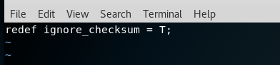

# chap0x12 实战Bro网络入侵取证
## 一.安装bro
* 安装bro
```
apt-get install bro bro-aux
```


报错:```could not get lock /var/lib/dpkg/lock -open```。
出现这个错误的原因可能是有另外一个程序正在运行，导致资源被锁不可用。而导致资源被锁的原因，可能是上次安装时没有正常完成。

而如果是刚打开虚拟机，```apt-get```在后台因系统自动更新故有程序正在运行，导致资源被锁不可用。

```
 ps aux | grep apt 查看后台运行的apt进程
```


* 在终端输入以下命令
```
rm /var/cache/apt/archives/lock
rm /var/lib/dpkg/lock
```


* 再次安装bro，成功。


## 二.查看实验环境基本信息
```
lsb_release -a 查看系统版本信息
uname -a 查看系统名
bro -v 查看bro版本信息
```


## 三.编辑bro配置文件
* 编辑```/etc/bro/site/local.bro```，在⽂件尾部追加两⾏新配置代码。
```
vim /etc/bro/site/local.bro
```


```
@load frameworks/files/extract-all-files
@load mytuning.bro
```


* 在 /etc/bro/site/ ⽬录下创建新⽂件```mytuning.bro```。
```
vim /etc/bro/site/mytuning.bro
```


```
redef ignore_checksums = T;
```



## 四.使用bro自动化分析pcap文件
* 下载attack-trace.pcap包文件。
```
wget  https://sec.cuc.edu.cn/huangwei/textbook/ns/chap0x12/attack-trace.pcap
```


* 使用bro自动化分析pcap文件
```
bro -r attack-trace.pcap /etc/bro/site/local.bro
```


出现警告信息```WARNING: No Site::local_nets have been defined. It's usually a good idea to define your local
networks.```对于本次入侵取证实验没有影响。

解决警告信息，编辑```mytuning.bro```,添加一行变量。
```
vim /etc/bro/site/mytuning.bro
```


```
redef Site::local_nets = { 192.150.11.0/24 };
```


修改完文件之后，再次运行bro自动化分析文件警告就没有了。


* 可以看到现在文件目录里面出现了新文件。
```conn.log```文件```files.log```文件和一个extract_files目录。


进入extrac_files目录下，会看到一个文件。


* 将该文件上传到virustotal，会发现有一个匹配的历史扫描报告。
该报告显示这是一个已知的后门程序。


## 五.逆向倒推
到这里，基于这个发现就可以进行逆向倒推，寻找入侵线索了。
* 阅读```usr/share/bro/base/files/extract/main.bro```源代码


可以看到```extract_files```中文件的文件名```FHUsSu3rWdP07eRE4l```是```files.log```中的文件的唯一标识符。

* 查看分析files.log
```cat files.log```


通过查看```files.log```，发现该⽂件提取⾃⽹络会话标识（bro根据IP五元组计算出的⼀个会话唯⼀性散列值）
为```CIEuyR2XXwhF0JSwUl```的FTP会话。

* 查看分析conn.log
```cat conn.log```


```bro-cut ts uid id.orig_h id.resp_h proto < coon.log```


通过```conn.log```的会话标识匹配找到id为```CIEuyR2XXwhF0JSwUl```的五元组信息,我们发现该PE文件来自于IPv4地址为98.114.205.102的主机。


## 六.参考资料
* [ubuntu常见错误--could not get lock /var/lib/dpkg/lock -open](http://www.cnblogs.com/hoys/archive/2011/06/28/2092308.html)

* [nsLecture0x12.pdf](http://sec.cuc.edu.cn/huangwei/course/2016/nsLecture0x12.pdf) 58—61页

* [同学作业](https://github.com/CUCCS/2018-NS-Public-MrCuihi/blob/ns_chap0x12/%E7%BD%91%E7%BB%9C%E5%AE%89%E5%85%A8/chap0x12/chap0x12%20%E5%AE%9E%E6%88%98Bro%E7%BD%91%E7%BB%9C%E5%85%A5%E4%BE%B5%E5%8F%96%E8%AF%81.md)
