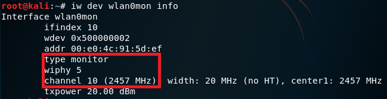

# mis_chap0x02 无线互联网监听实验报告
## 一、实验名称
802.11无线网络监听
## 二、实验问题
通过分析抓包保存的pcap⽂件：
* 查看统计当前信号覆盖范围内⼀共有多少独⽴的SSID？其中是否包括隐藏SSID？哪些⽆线热点是加密/⾮加密的？加密⽅式是否可知？
* 如何分析出⼀个指定⼿机在抓包时间窗⼝内在⼿机端的⽆线⽹络列表可以看到哪些SSID？这台⼿机尝试连接了哪些SSID？最终加⼊了哪些SSID？
* SSID包含在哪些类型的802.11帧？
## 三、实验准备
* 抓包器
wireshark、tshark、airodump-ng等
* 确认网卡接入。查看硬件接口信息（USB、外设是否连接正常等）。
这里因为多次调整，所以编号为5。
```
lsusb
```


* 查看网卡。通用网卡设置工具（IP、MAC相关设置）。
```
ifconfig
```


* 单独查看无线网卡的参数。网卡特性、工作模式查看与设置。
```
iwconfig
```
由此可看出，无线网卡的工作模式是managed，Access Point为Not-Associated。


* 查看phy_name。由于多次调整，故phy编号为5。
```
iw phy
```


* 查看当前网卡支持的监听信道
```
iw phy phy5 channels
```

.PNG)
.PNG)

* 结束可能对实验造成影响的其他监听模式。
```
airmon-ng check kill
```


* 开启wlan0的监听模式
```
airmon-ng start wlan0
```


* 进行检查
```
iw dev wlan0mon info
```
从图中可以看出，无线网卡处于开启状态，并且已经切换成monitor模式。channel为10。




* 进行抓包
```
airodump-ng wlan0mon
```


* 将抓到的包保存到本地。并且取名为20181006。
```
airodump-ng wlan0mon -w 20181006 --beacons
```


* 查看文件列表
```
ls -l
```


* 使用wireshark查看该文件
```
wireshark 20181006-01.cap
```


## 四、实验结果
1. 查看统计当前信号覆盖范围内⼀共有多少独⽴的SSID？其中是否包括隐藏SSID？哪些⽆线热点是加密/⾮加密的？加密⽅式是否可知？


* 由图中可看出当前信号覆盖范围内一共有5个独立的SSID，分别是：CMCC-WEB,CMCC,and-Business,CUC-Guest,CUC-WiFi。其中本次抓包没有抓到隐藏的SSID。
如果是隐藏的SSID，则长度会显示为0：<length: 0>


* 其中ENC显示为OPN的为非加密，加密则为WPA2。也就是说CMCC-WEB,and-Business,CUC-Guest为非加密的无线热点，CMCC,CUC-WiFi为加密的热点。其中加密方式不可知。

* 查看无线热点是否为加密非加密以及加密方式的确定也可以使用wireshark。


```
wlan.fixed.capabilities.privacy
0为未加密状态，1为加密状态。
```
```
wlan.fixed.auth.alg
```
可以看出没有筛选出符合要求的可以判断出热点加密方式的帧，所以无法判断其加密方式。
2. 如何分析出⼀个指定⼿机在抓包时间窗⼝内在⼿机端的⽆线⽹络列表可以看到哪些SSID？这台⼿机尝试连接了哪些SSID？最终加⼊了哪些SSID？
* 由于只要手机被覆盖在当前信号覆盖范围内，那么网卡所监听到的所有非隐藏SSID，都可以在手机端的无线网络中看到。这里因为隐藏的SSID只允许有过接入历史的设备连接，所以无法判定网卡捕捉到的隐藏SSID是否被手机端看到或接入。
* 如果手机尝试连接无线热点的时候，手机会向当前信号覆盖范围内的AP广播进行发送Probe Request帧，因此可以判断手机尝试连接了哪些SSID。又因为手机在与AP建立连接的时候，也会发送关联请求帧Association Request，而AP会回复相应帧Association Response来确认建立连接，所以因此可以判断手机最终加入了哪些SSID。


3. SSID包含在哪些类型的802.11帧？


SSID应该包含在Beacon Frame、Probe Request、Probe Response、Association RequestReassociation Request中，然而因为实验的片面性，类型有限，只有Beacon Frame和Probe Reqest和Probe Response中可以观察到SSID。

## 五、实验总结
1. 802.11帧类型
* 管理帧
管理帧负责监督无线网状态，主要用于建立第二层，即链路层与主机间的连接，管理数据包包括身份认证数据包、管理数据包和Beacon数据包等。（为了限制⼴播或组播管理帧所造成的副作用，收到管理帧后，必须加以查验。只有⼴播或者组播帧来自⼯作站当前所
关联的BSSID时，它们才会被送⾄MAC管理层，唯⼀例外的是Beacon帧。）
* 控制帧
控制帧通常与数据帧搭配使用，负责清空区域、获取信道和载波监听的维护，并在收到数据时予以确认以提⾼⼯作站之间数据传送的可靠性。（因为⽆线收发器通常只有半双⼯⼯作模式，即⽆法同时收发数据，为防⽌冲突，802.11允许⼯作站使用request to send和clear to send信号来清空传送区域）
* 数据帧
数据帧中包含实际需要传送的数据，并且是能够从⽆线⽹络转发到有线⽹络的唯⼀帧类型。
2. 无线数据抓包
3种不同的⽆线数据抓包⽅式（wireshark、tshark、airodump-ng）都可以抓取包含802.11完整帧结构的数据报⽂（Monitor模式下）或仅抓取802.11桢payload信息部分（Managed模式下）。
只有使⽤wireshark或tshark才能捕获物理层信息（radiotap，包含⽆线数据帧所⼯作的channel）。

## 六、参考资料
 [无线接入过程](https://blog.csdn.net/hmxz2nn/article/details/79937344)

 [移动互联网安全无线接入网监听](http://sec.cuc.edu.cn/huangwei/course/2017/misLecture0x02.pdf)
 
 [移动互联网安全教材](https://sec.cuc.edu.cn/huangwei/textbook/mis)
 
 [参考同学作业](https://github.com/CUCCS/2018-NS-Public-Jasmine2020/blob/ms_02/MobileSecurityHw02/mis_02无线接入网监听.md)