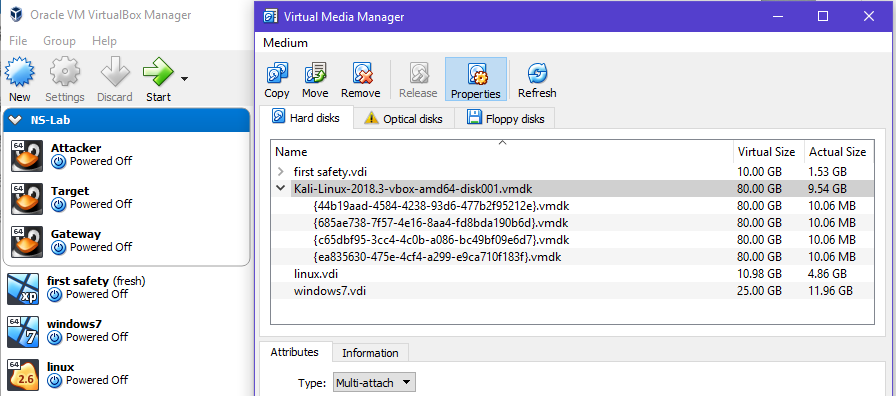

## 实验要求
* [x] chap0x01 基于VirtualBox的网络攻防基础环境搭建实例讲解
    * 节点：靶机、网关、攻击者主机
    * 连通性
        * 靶机可以直接访问攻击者主机
        * 攻击者主机无法直接访问靶机
        * 网关可以直接访问攻击者主机和靶机
        * 靶机的所有对外上下行流量必须经过网关
        * 所有节点均可以访问互联网
    * 其他要求
        * 所有节点制作成基础镜像（多重加载的虚拟硬盘）

## 实验过程
### 一、虚拟硬盘多重加载
* 安装好Kali虚拟器
* 查看虚拟介质管理，然后将Kali的类型改为**多重加载**，并进行释放。然后复制其所在的位置。

* 查看Kali虚拟机设置-存储，在SATA处添加虚拟硬盘，选择“使用现有的虚拟盘”，将复制的位置粘贴进路径，选择“确定”。


* 新建虚拟机，选择“使用已有的虚拟硬盘文件”，创建虚拟机。虚拟硬盘的多重加载完成。


### 二、三个节点的网络设置
```
攻击者：
NAT Network(eth0) ip:10.0.2.15
靶机：
Internal Network(eth0) ip:192.168.56.2
网关：
Internal Network(eth0) ip:192.168.56.1
NAT Network(eth1) ip:10.0.2.4
```
#### 配置成功截图：
* 攻击者网络配置图：

* 靶机网络配置图：

* 网关网络配置图：


### 三、开启网关的转发功能。添加网关防火墙规则

* 默认情况下，网关如果收到一个目的地址不是自己ip的包，会将其丢弃。这里开启网关的转发功能，将这些发往“别处”的包进行转发。
开启ipv4转发：
```
echo 1 > /proc/sys/net/ipv4/ip_forward
```
* 添加网关防火墙NAT规则
```
iptables -t nat -A POSTROUTING　-s 192.168.56.0/24 -o eth1 -j  MASQUERADE
```
* 配置图片


可以在网关的转发表中看到转发的规则

### 四、连通性测试
* 靶机ping通网关

* 靶机ping通攻击者

* 靶机连网

* 攻击者ping通网关

* 攻击者ping靶机不通

* 攻击者连网

* 网关ping通攻击者

* 网关ping通靶机

* 网关连网


### 五、网络拓扑图


### 六、问题与解决方法
* 网关无法打开双网卡的问题
1.  ```gedit /etc/network/interfaces```
打开interfaces文件后输入:
``` 
# This file describes the network interfaces available on your system
# and how to activate them. For more information, see interfaces(5).

# The loopback network interface
auto lo
iface lo inet loopback

# The primary network interface
allow-hotplug eth0
iface eth0 inet dhcp

allow-hotplug eth1
iface eth1 inet dhcp
```
2.  Virtualbox + Kali Rolling 的双网卡更优雅解决方案

复制以下内容到「终端(Terminal)」回车执行
```
cat << EOF >> /etc/network/interfaces
allow-hotplug eth0
iface eth0 inet dhcp

allow-hotplug eth1
iface eth1 inet dhcp
EOF

systemctl restart networking
```
3. 从屏幕右上角的菜单进入设置，在侧边栏选中Network，从右边进入已连接的那块网卡的设置界面（不同版本可能界面稍微不一样），然后点右下角的Remove Connection Profile。然后就可以启动另一块没有连通的网卡了。


* kail手动配置IP
```
$ vi /etc/network/interfaces

allow hotplug eth0
iface eth0 inet static
address 192.168.56.1
netmask 255.255.255.0
```


## 参考文献：
[Virtualbox 多重加载 高级功能介绍](https://blog.csdn.net/jeanphorn/article/details/45056251)
[VirtualBox: two network interfaces (NAT and host-only ones) in a Debian guest on Ubuntu](https://unix.stackexchange.com/questions/37122/virtualbox-two-network-interfaces-nat-and-host-only-ones-in-a-debian-guest-on)
[kali网络配置](https://www.jianshu.com/p/019935e003b4)