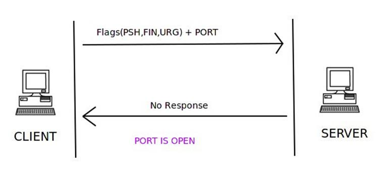
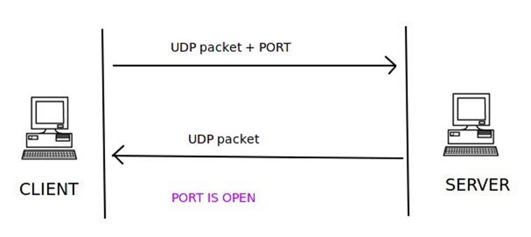
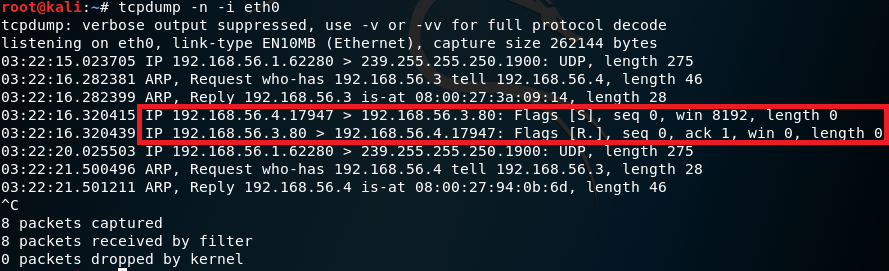
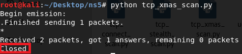
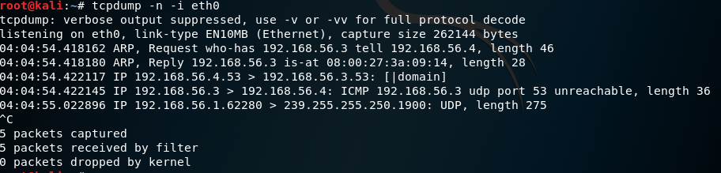

#  chap0x05
## 实验要求
* [x] 自己动手编程实现并讲解TCP connect scan/TCP stealth scan/TCP XMAS scan/UDP scan 

## 一、理论知识
### TCP connect scan
TCP连接是客户机和服务器之间的三次握手。如果进行了三方握手，那么就意味着双方之间建立了连接。


一个试图连接到端口80上的服务器的客户机通过发送设置了SYN标志的TCP包和它想要连接的端口(在本例中是端口80)来初始化连接。如果该端口在服务器上是打开的，并且已经在接受连接的过程中，它将使用设置了SYN和ACK标志的TCP包进行响应。连接是由客户机在最后一次握手时发送确认ACK和RST标志来建立的。如果完成了三次握手，那么可以说明该服务器上的该端口就是打开的。


客户端使用SYN标志和端口发送第一次握手，以连接到TCP包中的服务器。如果服务器响应的是RST而不是synack，那么该特定端口将在服务器上关闭。

- [tcp_connect_scan.py](pycode/tcp_connect_scan.py)

### TCP stealth scan


这种技术类似于TCP connect scan。客户端发送一个带有SYN标志和要连接的端口号的TCP包。如果端口是打开的，服务器将使用TCP包中的SYN和ACK标志进行响应。但这次客户端在TCP包中发送了一个RST标志，而不是在TCP连接扫描中发送的RST+ACK。该技术用于避免防火墙对端口扫描检测。


关闭端口检查与TCP连接扫描相同。服务器使用TCP包内设置的RST标志进行响应，以指示服务器上的端口已关闭

- [tcp_stealth_scan.py](pycode/tcp_stealth_scan.py)

### TCP XMAS scan



在XMAS扫描中，设置了PSH、FIN和URG标志的TCP包以及要连接的端口被发送到服务器。如果端口是打开的，那么服务器将不会响应。


如果服务器使用TCP包中设置的RST标志进行响应，则该端口在服务器上关闭。


如果服务器使用ICMP包进行响应，该包具有ICMP不可到达错误类型3和ICMP代码1、2、3、9、10或13，那么端口将被过滤，无论端口是打开的还是关闭的，都无法从响应中推断出来。

- [tcp_xmas_scan.py](pycode/tcp_xmas_scan.py)

### TCP中flag的总结
* SYN：建立连接时发送。
* RST:断开连接、拒绝不合法报文段、拒绝打开一个连接时发送。
* FIN:断开一个连接时发送。
* ACK：ACK=1时，确认序号段才有意义。

### UDP scan
TCP是面向连接的协议，UDP是无连接的协议。
面向连接的协议是一种协议，在这种协议中，客户端和服务器之间的通信通道应该是可用的，只有这样才能进行进一步的包传输。如果客户机和服务器之间没有通信通道，则不会进行进一步的通信。
无连接协议是指在不检查客户机和服务器之间是否有通信通道的情况下进行包传输的协议。假设目的地是可用的，那么数据就会被发送到目的地。



客户端发送一个带有端口号的UDP数据包来连接。如果服务器使用UDP包响应客户机，那么服务器上的特定端口就是打开的。


客户端发送UDP包和它想要连接的端口号，但是服务器用ICMP端口不可到达错误类型3和代码3进行响应，这意味着该端口在服务器上是关闭的。


如果服务器以ICMP错误类型3和代码1、2、9、10或13响应客户机，那么服务器上的端口将被过滤。


如果服务器没有对该端口的客户端UDP请求包发送响应，则可以得出这样的结论:服务器上的端口要么是打开的，要么是经过过滤的。端口的状态无法确定。
- [udp_scan.py](pycode/udp_scan.py)


## 二、实验准备工作
* 攻击者与靶机的网络设置：
```
攻击者：192.168.56.4
靶机：192.168.56.3
```
* 实验过程：
检测靶机的对应端口的状态，分别在open、closed和filtered的状态下，使用攻击者运行四个python脚本，同时靶机自身进行抓包。
* 攻击者网络设置：


* 靶机网络设置：


* 攻击者与靶机的连通性检测：


## 三、端口状态
### TCP
#### 查看靶机对应端口的状态
```
nmap -p 80 192.168.56.3
```


#### 打开靶机对应端口
```
apachectl -v
systemctl start apache2
```


#### 靶机对应端口进行过滤
```
iptables -A INPUT -p tcp --dport 80 -j DROP
```


### UDP
#### 查看靶机对应端口的状态
```
nmap -sU -p 53 192.168.56.3
```


#### 打开靶机对应端口
```
nc -ulp 53 
```


## 四、TCP connect scan
### 80端口关闭时：
* 攻击者运行脚本：


* 靶机抓包：


可以从靶机的抓包结果中看出，当80端口处于关闭状态的时候，攻击者向靶机发送了一个SYN包，靶机回复攻击者一个RST包。
### 80端口打开时：
* 攻击者运行脚本：


* 靶机抓包：


可以从靶机的抓包结果中看出，当80端口处于打开状态的时候，攻击者向靶机发送了一个SYN包，靶机回复攻击者一个RSYN包,然后攻击者又向靶机发送了一个RST包。
### 80端口被过滤时：
* 攻击者运行脚本：


* 靶机抓包：


可以从靶机的抓包结果中看出，当80端口处于被过滤状态的时候，攻击者向靶机发送了一个SYN包，而靶机没有回复。
## 五、TCP stealth scan
### 80端口关闭时：
* 攻击者运行脚本：


* 靶机抓包：



可以从靶机的抓包结果中看出，当80端口处于关闭状态的时候，攻击者向靶机发送了一个SYN包，靶机回复攻击者一个RST包。
### 80端口打开时：
* 攻击者运行脚本：


* 靶机抓包：


可以从靶机的抓包结果中看出，当80端口处于打开状态的时候，攻击者向靶机发送了一个SYN包，靶机回复攻击者一个RSYN包,然后攻击者又向靶机发送了一个RST包。
### 80端口被过滤时：
* 攻击者运行脚本：


* 靶机抓包：


可以从靶机的抓包结果中看出，当80端口处于被过滤状态的时候，攻击者向靶机发送了一个SYN包，而靶机没有回复。
## 六、TCP XMAS scan
### 80端口关闭时：
* 攻击者运行脚本：



* 靶机抓包：


可以从靶机的抓包结果中看出，当80端口处于关闭状态的时候，攻击者向靶机发送了一个FPU包，靶机回复攻击者一个RST包。
### 80端口打开时：
* 攻击者运行脚本：


* 靶机抓包：


可以从靶机的抓包结果中看出，当80端口处于打开状态的时候，攻击者向靶机发送了一个FPU包，靶机没有回复攻击者。
### 80端口被过滤时：
* 攻击者运行脚本：


* 靶机抓包：


可以从靶机的抓包结果中看出，当80端口处于被过滤状态的时候，攻击者向靶机发送了一个FPU包，而靶机没有回复。
## 七、UDP scan
### 53端口关闭时：
* 攻击者运行脚本：


* 靶机抓包：


### 53端口打开时：
* 攻击者运行脚本：


* 靶机抓包：




## 八、问题与备注：
* 靶机与攻击者无法连通，改为host-only网络，并在宿主机中打开虚拟机的网络设置。
* 修改主机名：
```
hostnamectl set-hostname victim
```

## 九、参考资料

[Port Scanning using Scapy](https://resources.infosecinstitute.com/port-scanning-using-scapy/)

[本次作业老师与同学的修改意见](https://github.com/CUCCS/2018-NS-Public-yang5220/pull/3)

